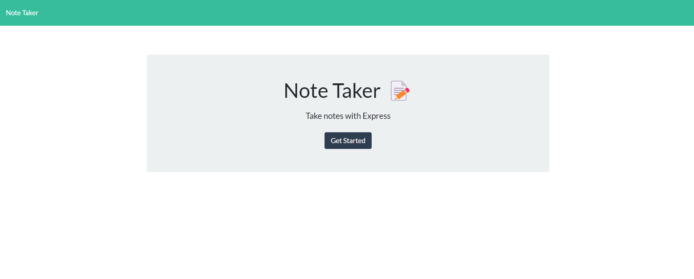
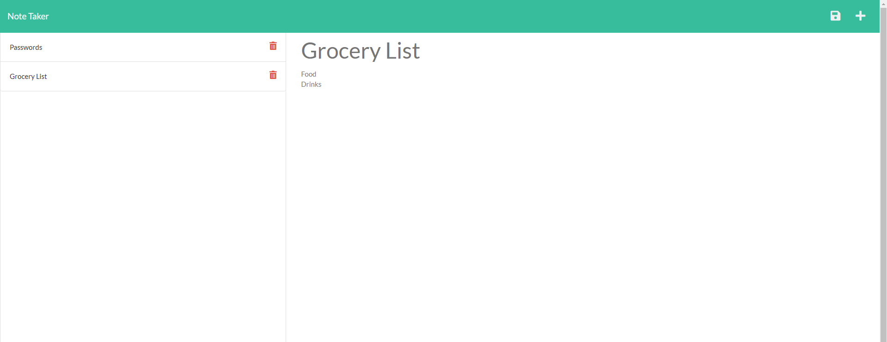
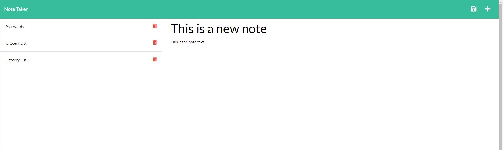
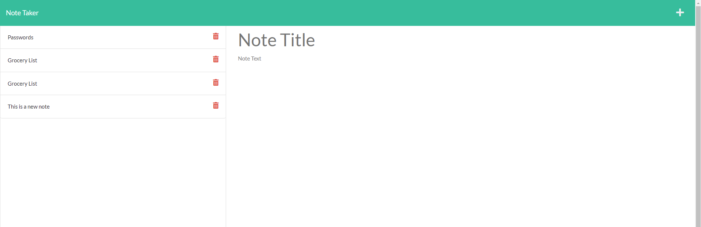

# Note Taker

## Description

This is a web app that you can use as a note taker. Just fill in your note with a title and some text in the note and click the save button that will appear once both fields have something in them. This will add your note onto the list on the left. From there you can click on any of the notes on your list on the left. This will open up a read only version of the note that you can read. If you have a note you don't want anymore, just click on the garbage icon on the note and the note will be removed from your list and won't exist anymore.

## Table of Contents

* [Technologies](#technologies)
* [Installation](#installation)
* [Usage](#usage)
* [Questions](#questions)
* [License](#license)

## Technologies

| Technology | Link |
| -------- | ------|
| HTML |   |
| Javascript |    |
| Node.js | https://nodejs.org/en/ |
| npm | https://www.npmjs.com/ |
| uuidv4 | https://www.npmjs.com/package/uuidv4 |

## Installation

npm install

## Usage

When you open the page you will be at the landing page, with a button that you can click to go to the notes page.  

Picture of landing page:  

  

On the note page you will be able to see all past notes that had been added on the left, they will be displayed by the title. If there are no notes then nothing will be displayed.  

Picture of notes page with a past note brought up:  

  

To add a new note you can click on the + in the top right, or if you had just gotten to the notes page you will already be on the add note section. Type in your title and note text and a save button will appear in the top left. Click the save icon and your note will be moved to the notes section.

Picture of note page typed up:  

  

Picture of note added:  

  

If after you have added notes you would like to delete any of them, just click on the garbage icon. From there the note will be removed from your list, and it will also be removed from the database. The note will not exist anymore though so be careful, since you won't be able to view it again.

## Questions
If you have any questions you can reach me at:  
Github: cmwschroeder  
Github link: https://github.com/cmwschroeder  
Email: cmwschroeder@gmail.com

## License

Licensed under the [MIT License](LICENSE)